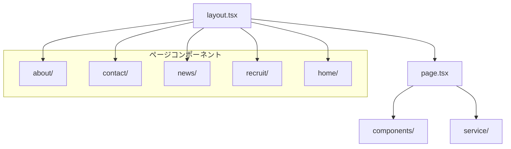
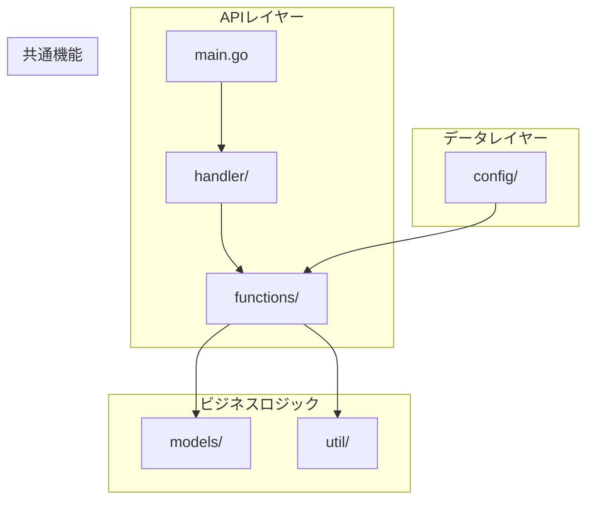

# アプリケーション詳細構造

## フロントエンド（Next.js）

### ディレクトリ構造
```
src/
└── app/
    ├── components/     # 共通コンポーネント
    ├── service/        # APIサービス層
    ├── about/         # 会社概要ページ
    ├── contact/       # お問い合わせページ
    ├── news/          # ニュースページ
    ├── recruit/       # 採用情報ページ
    ├── home/          # ホームページ
    ├── fonts/         # フォント設定
    ├── page.tsx       # ルートページ
    ├── layout.tsx     # ルートレイアウト
    ├── names.ts       # 定数定義
    ├── globals.css    # グローバルスタイル
    └── favicon.ico    # ファビコン
```

### 主要コンポーネント構成



## バックエンド（Go）

### 詳細構造
```
backend/
├── config/           # アプリケーション設定
├── functions/        # ビジネスロジック
│   └── *.go         # 各機能のロジック実装
├── handler/
│   └── handler.go   # APIエンドポイントハンドラー
├── models/
│   └── models.go    # データモデル定義
├── util/            # ユーティリティ関数
├── main.go          # アプリケーションエントリーポイント
├── go.mod           # Go依存関係定義
└── go.sum           # Go依存関係ロック
```

### アーキテクチャ詳細



## 主要機能一覧

### フロントエンド
- **ページ機能**
  - ホーム（`/home`）
  - 会社概要（`/about`）
  - お問い合わせ（`/contact`）
  - ニュース（`/news`）
  - 採用情報（`/recruit`）

- **共通機能**
  - レスポンシブデザイン
  - カスタムフォント最適化
  - グローバルスタイリング

### バックエンド
- **API機能**
  - RESTful APIエンドポイント
  - ビジネスロジック処理
  - データモデル管理

## 技術的特徴

### フロントエンド
- Next.js App Routerによるファイルベースルーティング
- TypeScriptによる型安全性
- Tailwind CSSによるスタイリング
- コンポーネントベースのアーキテクチャ

### バックエンド
- クリーンアーキテクチャに基づく層分け
- 依存性の明確な分離
- モジュール化された機能実装

---
注: さらに詳細な実装内容を確認するため、各コンポーネントとAPIエンドポイントの調査を継続中です。 