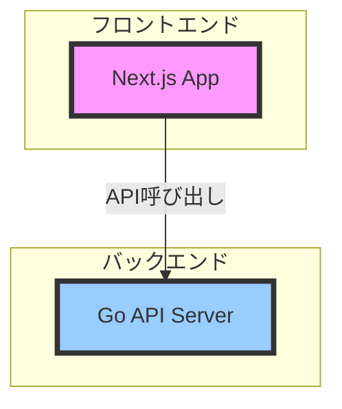

# プロジェクト概要ドキュメント

## システム構成



## 技術スタック

### フロントエンド
- **フレームワーク**: Next.js (App Router)
- **言語**: TypeScript
- **スタイリング**: Tailwind CSS
- **パッケージマネージャー**: npm
- **最適化**: next/font (Geistフォント)

### バックエンド
- **言語**: Go
- **アーキテクチャ**: クリーンアーキテクチャベース
  ```mermaid
  graph TB
      Handler[Handlers] --> Functions[Functions]
      Functions --> Models[Models]
      Functions --> Util[Utilities]
      Config[Config] --> Functions
  ```

## プロジェクト構造

### フロントエンド構造
```
src/
├── app/        # Next.js アプリケーションコード
└── styles/     # グローバルスタイル
```

### バックエンド構造
```
backend/
├── config/     # 設定ファイル
├── functions/  # ビジネスロジック
├── handler/    # APIハンドラー
├── models/     # データモデル
├── util/       # ユーティリティ関数
└── main.go     # エントリーポイント
```

## 開発環境セットアップ

### フロントエンド
1. Node.jsのインストール（.nvmrcに指定されたバージョン）
2. 依存関係のインストール
   ```bash
   npm install
   ```
3. 開発サーバーの起動
   ```bash
   npm run dev
   ```
   - http://localhost:3000 でアクセス可能

### バックエンド
1. Goのインストール
2. 依存関係のインストール
   ```bash
   cd backend
   go mod download
   ```
3. サーバーの起動
   ```bash
   go run main.go
   ```

## デプロイメント
- フロントエンド: Vercel推奨
- バックエンド: 未定義（要確認）

## 注意事項
- フロントエンドはApp Routerを採用しており、最新のNext.js機能を活用
- バックエンドはクリーンアーキテクチャの原則に従って設計
- 環境変数の設定が必要（具体的な変数は要確認）

---
注: このドキュメントは初期調査に基づいて作成されています。詳細な実装や設定については、さらなる調査が必要です。 